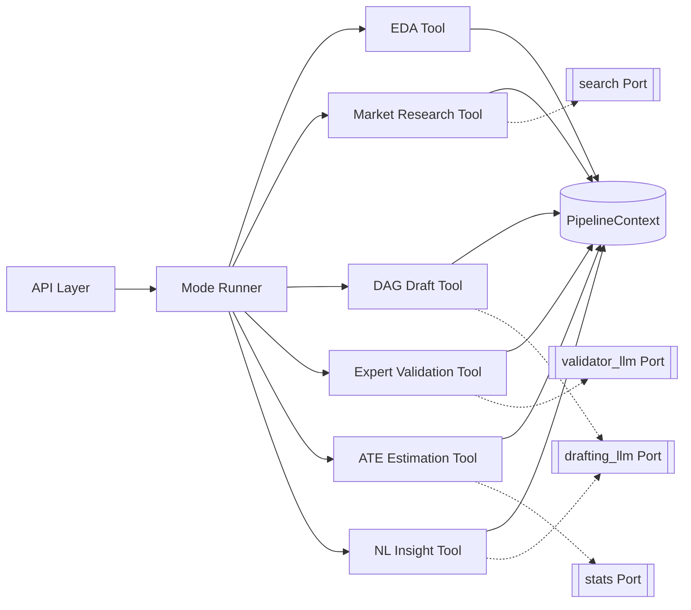
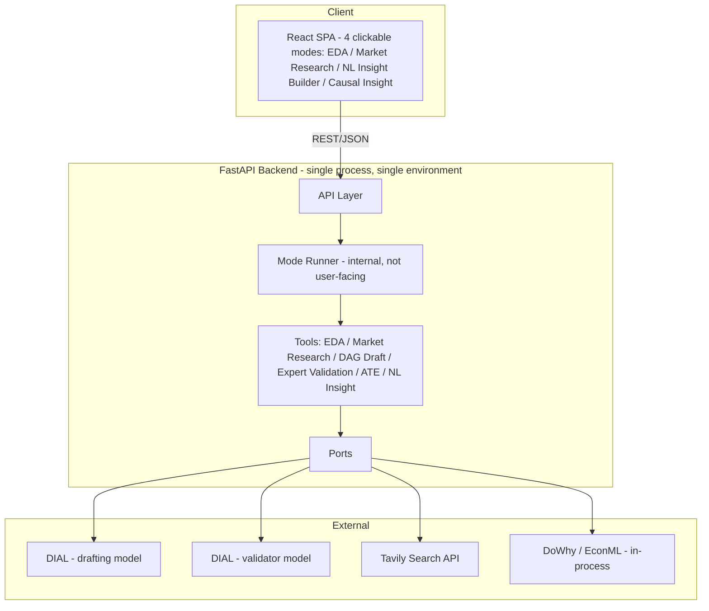

# Architecture Spine — Causal Sense

## Design Paradigm

**Hexagonal core (ports & adapters) wrapping a pipes-and-filters domain pipeline.**

- The domain layer is a set of shared **Tools** — EDA, Market Research, DAG Draft, Expert Validation, ATE Estimation, NL Insight — each a stateless filter with a fixed input/output contract (`PipelineContext`, see AD-5). There is no user-facing "orchestrator" concept: the product surface is 4 clickable Modes (EDA, Market Research, NL Insight Builder, Causal Insight). Internally, one composition module (**Mode Runner**) still owns the fixed Mode → Tool-sequence table (AD-7) so the overlapping tool sequences between Market Research and Causal Insight aren't wired twice — it's an implementation detail, never surfaced as a concept to the user or in the UI.
- All I/O to the outside world (two DIAL LLMs, Tavily, DoWhy/EconML) is reached only through **Ports**; Tools never import an external SDK directly (AD-2).
- Namespace mapping: `api/` (adapters in), `mode_runner/` (composition), `tools/` (domain filters), `ports/` (interfaces), `adapters/` (external implementations of ports).

## Invariants & Rules

### AD-1 — Layered dependency direction
- **Binds:** all
- **Prevents:** a Tool or the API layer reaching around Mode Runner/Ports straight into an external SDK, creating hidden coupling two teammates can't see in each other's code.
- **Rule:** Dependencies flow one way only: `api` → `mode_runner` → `tools` → `ports` → `adapters`. No reverse import. A Tool may depend on a Port interface, never on a concrete adapter or an external client library.

### AD-2 — Two named, structurally-distinct LLM ports
- **Binds:** FR-8, FR-9
- **Prevents:** the Validator LLM silently resolving to the same model/key as the Drafting LLM, which would make "cross-model validation" a Responsible-AI claim the system doesn't actually enforce.
- **Rule:** Two named port instances, `drafting_llm` and `validator_llm`, each configured with a distinct DIAL model + API key. Startup fails fast if both resolve to the same model+key pair.

### AD-3 — Uniform Tool result envelope
- **Binds:** all Tools
- **Prevents:** one Tool's uncaught exception producing a blank screen or stack trace on stage; inconsistent per-tool error shapes forcing Mode Runner to special-case each one.
- **Rule:** Every Tool returns `{status: "ok" | "degraded" | "error", data, message}`. Tools catch their own failures and degrade; they never raise past their own boundary.

### AD-4 — Canonical PipelineContext, schematized
- **Binds:** FR-2, FR-3, FR-4, FR-5, FR-6, FR-7, FR-8, FR-9, FR-10, FR-11, FR-12, FR-13
- **Prevents:** two independently-built Tools (e.g. EDA owned by Rupesh, DAG Draft owned by core) inventing incompatible shapes for the same handoff — the time-column flag, the DAG edge shape, the Market Research summary shape, or the edge-status vocabulary.
- **Rule:** One `PipelineContext` schema threads schema-inference, EDA result, Market Research result (incl. optional DAG), validation result, and ATE result between Tools within a single Mode Runner invocation. A Tool reads only the fields it needs and writes only its own designated field — never repurposes another Tool's field. The Market Research and DAG fields are pinned to this shape (not left to prose):

```text
market_research_result: { summary: str, sources: [{title: str, url: str}], scope: "time_bounded" | "column_context" | "none" }
dag: { nodes: [str], edges: [{ source: str, target: str, confidence: float, status: "auto_validated" | "escalated" | "user_accepted" | "user_rejected" }] } | null
```
- **Mutation discipline:** Tools receive `PipelineContext` and return an updated value (never mutate in place); Mode Runner alone persists the returned value back to the session store (AD-5) after each Tool call. A Tool's output landing only in its AD-3 envelope and never reaching the session store is a bug, not a valid interpretation.



### AD-5 — No persistence; ephemeral session state
- **Binds:** all `[ADOPTED — PRD §5 Non-Goals]`
- **Prevents:** scope creep into accounts/history that the PRD explicitly excludes, and divergent ad hoc caching per Tool.
- **Rule:** Session state (uploaded data, PipelineContext) lives entirely server-side in-memory, keyed by a `session_id` issued at upload, single-process, TTL-evicted. No database, no cross-session persistence.

### AD-6 — Async job scoped to Causal Insight only; Market Research is two synchronous calls; Expert Validation is a hard barrier in both
- **Binds:** FR-8, FR-9, FR-10, FR-11 (Causal Insight mode); FR-5, FR-6, FR-7, FR-8, FR-9, FR-10 (Market Research mode); FR-3, FR-4, FR-12, FR-13 (EDA, NL Insight Builder)
- **Prevents:** one teammate building a websocket/streaming solution for progress while another builds polling for the same 60-90s-pipeline NFR requirement; a mode silently defaulting escalated edges to accept/reject so it can complete non-interactively, which would let ATE run before FR-9's human decision arrives — breaking UJ-1's climax and SM-6 on stage; Market Research and Causal Insight each inventing their own shape for the same escalated-edge decision step.
- **Rule:** Only **Causal Insight** (the full pipeline) runs as an async job: `POST /causal-insight` returns a `job_id` immediately; `GET /jobs/{job_id}` polls `{status, current_step, result?}`. EDA, Market Research, and NL Insight Builder are synchronous request/response `[ASSUMPTION — Market Research's search + DAG + Validation + ATE sequence completes within a tolerable synchronous request window for the demo; revisit if its ATE latency approaches the same 60-90s bound as Causal Insight]`.
  - `status` is one of: `queued | running | awaiting_review | done | error`.
  - `current_step` is one of the six Tool names: `eda | market_research | dag_draft | expert_validation | ate_estimation | nl_insight`.
  - **Causal Insight (async):** when Expert Validation (FR-9) produces one or more escalated edges, the job sets `status: "awaiting_review"` and **halts before ATE Estimation starts**. `PATCH /jobs/{job_id}/edges` submits per-edge decisions (`{edge: {source, target}, decision: "accept" | "reject"}`); once all escalated edges are decided, the job resumes automatically from ATE Estimation.
  - **Market Research (sync, two calls):** `POST /market-research` runs Market Research search → DAG Draft → Expert Validation. If no edges are escalated, it continues straight into ATE Estimation and returns the complete result in that same call (`status: "done"`). If one or more edges are escalated, it returns immediately with `status: "awaiting_review"` and the escalated edges — no `job_id`, no polling, ATE Estimation does not run yet. `PATCH /market-research/{session_id}/edges` submits the same per-edge decision shape as above and, within that single blocking call, runs ATE Estimation and returns the final result.
  - Both flows enforce the same invariant: ATE Estimation never runs while an escalated edge for that session/job is undecided — Market Research and Causal Insight differ only in async-vs-sync transport, not in the barrier itself.
  - **Concurrency guardrail:** a session with a Causal Insight job in a non-terminal state (`queued | running | awaiting_review`), or a Market Research call in `awaiting_review` awaiting its `PATCH .../edges`, rejects a concurrent Causal Insight, Market Research, or NL Insight Builder request against the same `session_id` with `error_code: "SESSION_BUSY"` (AD-8 envelope), rather than allowing two requests to read/write the same session's `PipelineContext` concurrently. `[ASSUMPTION — one active action per session at a time is safe for a single-presenter live demo]`

### AD-7 — Mode Runner owns mode composition (not user-facing), and reads/merges session context rather than starting blank
- **Binds:** FR-5, FR-8, FR-9, FR-10, FR-12, FR-13, FR-14, FR-16
- **Prevents:** the API layer or the React UI branching pipeline logic itself, bypassing the shared-tool requirement FR-16 depends on; a mode invocation silently dropping context another mode produced earlier in the same session (e.g. NL Insight Builder never surfacing Market Research/DAG results that already ran); Market Research and Causal Insight each hand-wiring their own copy of the DAG Draft → Expert Validation → ATE Estimation sequence.
- **Rule:** The product surface is exactly 4 clickable Modes — **EDA**, **Market Research**, **NL Insight Builder**, **Causal Insight** — never an LLM-inferred router, and never a "solution orchestrator" concept exposed to the user. The API layer only translates HTTP ↔ Mode Runner calls. A fixed, versioned Mode → Tool-sequence table lives in **Mode Runner** and nowhere else, so Market Research and Causal Insight share one definition of the DAG/Validation/ATE sequence instead of duplicating it. Each Mode Runner invocation first reads the session's existing `PipelineContext` from the session store (AD-5) if one exists for that `session_id`, and merges newly-produced fields into it rather than starting blank — a Tool never overwrites a field already populated by an earlier mode in the same session unless that mode is explicitly being re-run.

| Mode | Tool sequence | Transport |
| --- | --- | --- |
| EDA | EDA | sync |
| Market Research | Market Research → DAG Draft → Expert Validation (hard barrier) → ATE Estimation | sync, two calls (see AD-6) |
| NL Insight Builder | Schema Inference (FR-2) → NL Insight (automatic + conversational), reading any `market_research_result`/`dag`/ATE result already present in the session's PipelineContext per this AD | sync |
| Causal Insight | EDA → Market Research → DAG Draft → Expert Validation (hard barrier, see AD-6) → ATE Estimation → NL Insight | async job (see AD-6) |

`[ASSUMPTION — supersedes the earlier mode table where Market Research was search-only and DAG/Validation/ATE lived solely under a mode named "Causal Analysis"; the PRD's Mode/"Solution Orchestrator" glossary entries and §4.2 Market Research description predate this split — flagged for the user to reconcile upstream.]`

### AD-8 — Structured error contract, with a fixed Tool-envelope-to-HTTP mapping
- **Binds:** FR-1, FR-15, all API responses
- **Prevents:** a raw exception/traceback reaching the client (the single failure mode the Reliability NFR calls out by name); two API routes inventing different mappings from a Tool's AD-3 envelope to an HTTP response.
- **Rule:** Every non-2xx API response is `{error_code, message, actionable_hint}`. No unhandled exception is allowed to serialize past the API boundary. Tool envelope → HTTP mapping is fixed: `status: "ok"` → 200 with `data`; `status: "degraded"` → 200 with the degraded envelope passed through as-is in the response body (not an error); `status: "error"` → non-2xx with `error_code` drawn from a fixed per-Tool error taxonomy. Every EDA/session-bearing response also carries `causal_insight_run: bool` for that `session_id`, so the frontend's FR-15 nudge-suppression logic reads a backend-sourced signal instead of reconstructing it from local state.

### AD-9 — Secrets never cross the client boundary
- **Binds:** all `[ADOPTED — PRD Privacy/Security NFR]`
- **Prevents:** a DIAL key or the Tavily key leaking into the React bundle, a network response, or a log line.
- **Rule:** React SPA is a pure REST/JSON client. All LLM and Tavily calls are backend-proxied; no external API key is ever sent to or readable from the client.

## Consistency Conventions

| Concern | Convention |
| --- | --- |
| Naming (entities, files, interfaces, events) | Tools named `<Noun>Tool` (e.g. `EDATool`); Ports named `<noun>_port` (e.g. `drafting_llm`, `search`, `stats`); FastAPI routes plural-resource style (`/sessions`, `/jobs/{id}`) |
| Data & formats (ids, dates, error shapes, envelopes) | `session_id`/`job_id` as UUID4 strings; dates ISO-8601; every Tool result uses the AD-3 envelope; every API error uses the AD-8 envelope |
| State & cross-cutting (mutation, errors, logging, config, auth) | No auth in v1 (no accounts, AD-5); config (DIAL keys, Tavily key, model names) loaded from environment only, never committed; structured logging includes `session_id`/`job_id` for traceability (Explainability NFR) |

## Stack

| Name | Version |
| --- | --- |
| Python | >=3.12,<3.14 *(downgraded from >=3.14 — DoWhy/EconML don't support 3.14 yet, verified 2026-07-11)* |
| FastAPI | ~0.139 (current stable, verified 2026-07-11) |
| Pydantic | v2 |
| uvicorn | latest matching FastAPI |
| DoWhy | 0.14 (requires Python <3.14,>=3.9 — verified) |
| EconML | 0.16.0 (supports up to Python 3.13 — verified) |
| pandas | latest stable `[not independently version-verified — low risk, stable API]` |
| openai (SDK, pointed at DIAL base_url) | 2.45.0 (verified current 2026-07-11) — used for both `drafting_llm` and `validator_llm` ports with distinct config; DIAL's OpenAI-compatibility is asserted per prior team decision, not independently checkable via public docs |
| tavily-python | latest stable `[not independently version-verified — low risk, thin client SDK]` |
| React | 19.2.7 (verified 2026-07-11) |
| Vite + @vitejs/plugin-react | Vite 8.1.4, plugin-react v6 (verified 2026-07-11) |
| uv | existing project package manager (already in use) |

## Structural Seed



**Deployment & environments:** Single demo environment — one process (or one VM), run and rehearsed exactly as it will be demoed. No CI/CD pipeline, no staging/prod split — deliberately out of scope given the 2026-07-13 deadline, not an oversight.

```text
{repo-root}/
  src/
    api/            # FastAPI routes; HTTP <-> Mode Runner translation only (AD-7)
    mode_runner/     # mode -> tool-sequence table + PipelineContext lifecycle (AD-4, AD-7); internal, not user-facing
    tools/           # eda.py, market_research.py, dag_draft.py, expert_validation.py, ate_estimation.py, nl_insight.py
    ports/           # llm_port.py (drafting_llm, validator_llm), search_port.py, stats_port.py — interfaces only
    adapters/        # dial_llm_adapter.py, tavily_adapter.py, dowhy_econml_adapter.py — concrete implementations
    session/         # in-memory session store, TTL eviction (AD-5)
  frontend/
    src/
      modes/         # EDA/, MarketResearch/, NLInsightBuilder/, CausalInsight/ — one screen tree per FR-14, the 4 clickable options
  tests/
  docs/
```

## Capability → Architecture Map

| Capability / Area | Lives in | Governed by |
| --- | --- | --- |
| FR-1, FR-2 Ingestion & schema inference | `tools/eda.py` (schema step), `api/` upload route | AD-3, AD-8 |
| FR-3, FR-4 EDA (temporal / cross-sectional) | `tools/eda.py` | AD-1, AD-4 |
| FR-5, FR-6, FR-7 Market Research | `tools/market_research.py`, `ports/search_port.py` (Market Research mode + upstream enrichment within Causal Insight) | AD-1, AD-2 (n/a), AD-4 |
| FR-8 DAG Draft | `tools/dag_draft.py`, `ports/llm_port.py` (`drafting_llm`) (Market Research mode and Causal Insight mode) | AD-2, AD-4 |
| FR-9 Expert Validation | `tools/expert_validation.py`, `ports/llm_port.py` (`validator_llm`); `PATCH /jobs/{job_id}/edges` (Causal Insight, async) or `PATCH /market-research/{session_id}/edges` (Market Research, sync) | AD-2, AD-4, AD-6 (hard barrier, both modes) |
| FR-10 ATE Estimation | `tools/ate_estimation.py`, `ports/stats_port.py` (DoWhy/EconML) (Market Research mode and Causal Insight mode) | AD-1, AD-4, AD-6 (gated on FR-9 decisions, both modes) |
| FR-11 Pipeline-embedded NL Insight | `tools/nl_insight.py` (within Causal Insight) | AD-4 |
| FR-12, FR-13 NL Insight Builder | `tools/nl_insight.py`, `mode_runner/` (NL Insight Builder sequence) | AD-4, AD-6 (concurrency guardrail), AD-7 (session-context merge) |
| FR-14 Mode selection UI (4 clickable options) | `frontend/src/modes/*` | AD-7 |
| FR-15 Proactive nudge | `frontend/src/modes/*` (reads `causal_insight_run` flag) | AD-8 |
| FR-16 Shared tool composition (Mode Runner, not user-facing) | `mode_runner/` | AD-7 |

## Deferred

- **Multi-turn conversation memory** for NL Insight Builder (PRD Open Question 4) — affects whether `session/` needs a conversation-turn buffer beyond `PipelineContext`; revisit before dress rehearsal.
- **Demo-day contingency mechanism** (PRD Open Question 3: pre-recorded backup vs. cached result vs. rehearsal-only) — would add a fallback path inside the relevant Port adapters; deliberately left open pending the team's decision.
- **Tavily query-strategy generalization** (PRD Open Question 2) — lives inside `tools/market_research.py`; not an architectural boundary concern, left to implementation.
- **Database connectivity / persistence** — v2 Future Scope per PRD §6.2; no schema fixed now.
- **Multi-instance / horizontal scaling of session store** — single-process in-memory store (AD-5) is sufficient for one demo; not designed for concurrent multi-instance deployment.
- **CI/CD pipeline** — explicitly not built; single rehearsed environment only (see Deployment & environments above).
- **DoWhy/EconML DML-estimator sensitivity** — a known interop gotcha (py-why/dowhy#1289): DML-based ATE for continuous treatments can be insensitive to the control/treatment value range and diverge from GLM baselines. Not an architectural boundary concern, but Aaishwarya (FR-10 owner) should read the issue before picking an estimator inside `tools/ate_estimation.py`.
